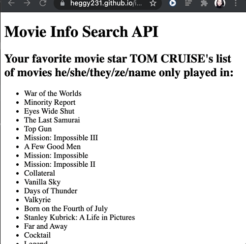

# MovieDB's My Favorite Movie Stars:

- [Demo](https://heggy231.github.io/imdb-my-favorite-movie-stars/)

- [Code](https://github.com/heggy231/imdb-my-favorite-movie-stars)

## How to run the MovieDB's My Favorite Movie Stars APP:

- First, go to the [Live Demo](https://heggy231.github.io/imdb-my-favorite-movie-stars/) site.

- Follow the first prompt and enter the name of favorite movie star.

- Then, enter two movie stars names to see who played the most movies.

- The user sees who won the movie match then the list of movies that favorite movie start played displayed on the screen.

- To re-play the app, click the "Page Refresh" button on your browser.
